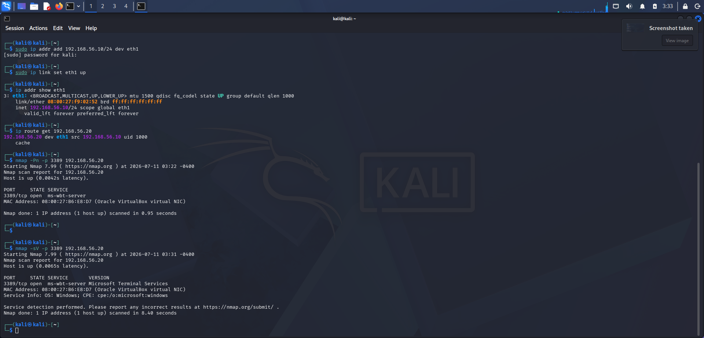
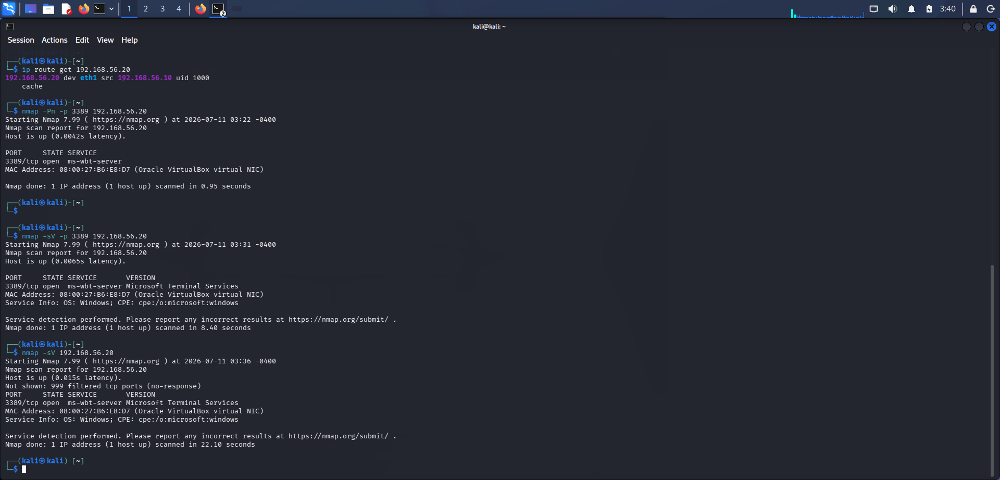

# Home-SOC-Lab
Building a Home Security Operations Center using Kali Linux, Windows, and Wazuh SIEM.

# Home SOC Lab

## Objective
Build a Security Operations Center lab using:
- Kali Linux
- Windows 10
- Wazuh SIEM

## Lab Architecture
Kali (Attacker) → Windows (Victim) → Wazuh (Monitoring)

## Skills Demonstrated
- Network scanning
- Vulnerability assessment
- Log analysis
- Incident response

## Network Routing and RDP Service Detection

During initial reconnaissance, TCP port 3389 appeared filtered. Investigation showed that Kali was routing traffic through the NAT interface instead of the dedicated SOC-LAB interface. After correcting the network configuration, the Windows RDP service became reachable.

**Figure 1.** Verification of the corrected SOC-LAB route from Kali Linux (`192.168.56.10`) to the Windows 10 victim (`192.168.56.20`). Nmap subsequently confirmed that TCP port 3389 was open and reachable.

## Nmap Service Discovery

Following successful network connectivity, Nmap service detection was performed against the Windows 10 victim to identify exposed network services.

**Figure 2.** Nmap reconnaissance of the Windows 10 victim (`192.168.56.20`) confirmed TCP port 3389 as open and identified the exposed service as Microsoft Terminal Services (RDP). A broader service scan found 999 of the 1,000 commonly scanned TCP ports filtered, with RDP as the only detected open service.
